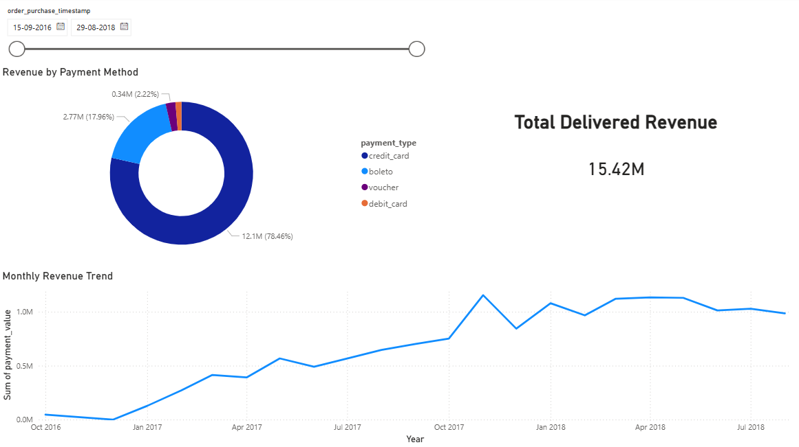

## 📊 Key Business Insights & Strategic Recommendations

## 📈 Executive Power BI Dashboard

I built an interactive Business Intelligence dashboard to allow stakeholders to filter revenue trends, monitor AOV, and track payment behaviors dynamically.

Based on the SQL analytics and Python data modeling, here are the core findings for the executive team:

**1. The "Leaky Bucket" Retention Problem (Urgent)**
* **What happened:** 97% of our user base consists of one-time buyers. Furthermore, our recency analysis shows that over 70% of customers are either "Churned" or "Lost" (no purchases in 6+ months). 
* **Why it matters:** We are highly effective at user acquisition but failing at retention. Customer Lifetime Value (LTV) is severely capped.
* **Recommendation:** Implement a 30-day and 90-day post-purchase re-engagement email sequence offering targeted discounts on complementary products.

**2. High Cart Abandonment Rate**
* **What happened:** Our funnel analysis reveals a 69.6% cart abandonment rate. Users are adding items to their carts but dropping off before payment.
* **Recommendation:** Deploy automated "abandoned cart" push notifications/emails within 2 hours of drop-off. Simplify the checkout UI to reduce friction.

**3. Payment Type Drives Order Value**
* **What happened:** Customers using Credit Cards have the highest Average Order Value (AOV) at $162.86, while Voucher users have the lowest ($93.24).
* **Recommendation:** Partner with credit card providers to offer cash-back incentives or "Buy Now, Pay Later" (BNPL) options to push users toward higher-AOV payment methods.

**4. Black Friday Seasonality**
* **What happened:** Revenue shows steady MoM growth but experiences extreme spikes in November (Black Friday). 
* **Recommendation:** Supply chain and server infrastructure must be stress-tested by October. Marketing budgets should be heavily front-loaded into early November to capture high-intent traffic.